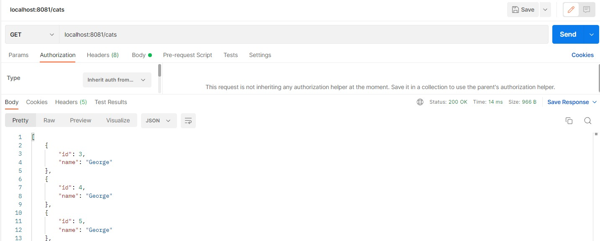
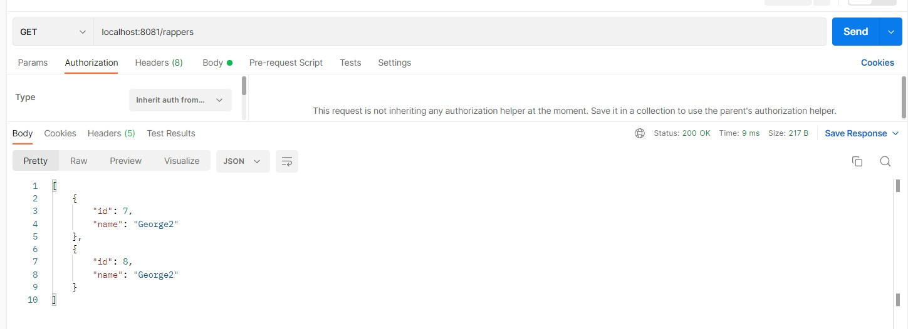
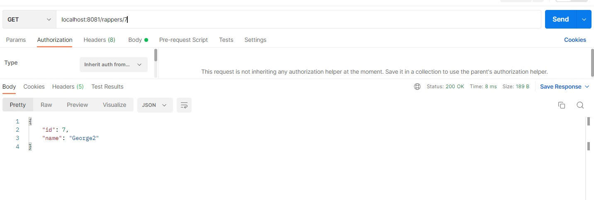
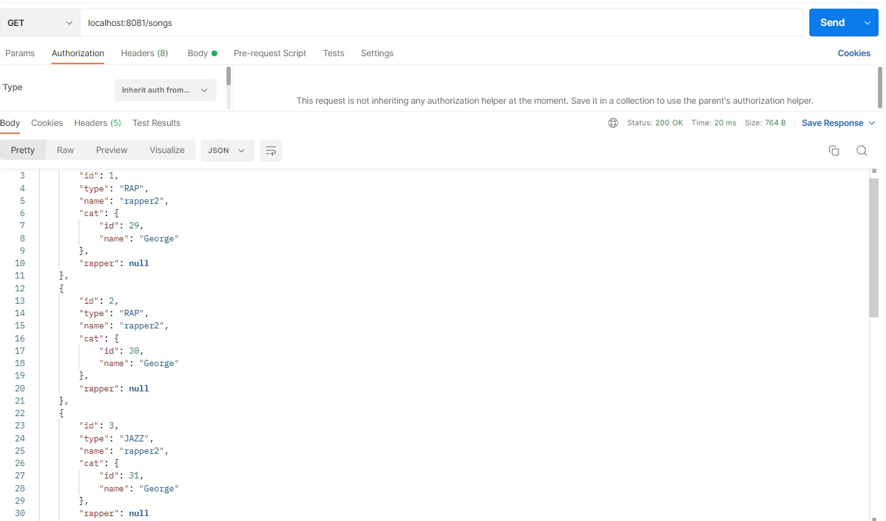
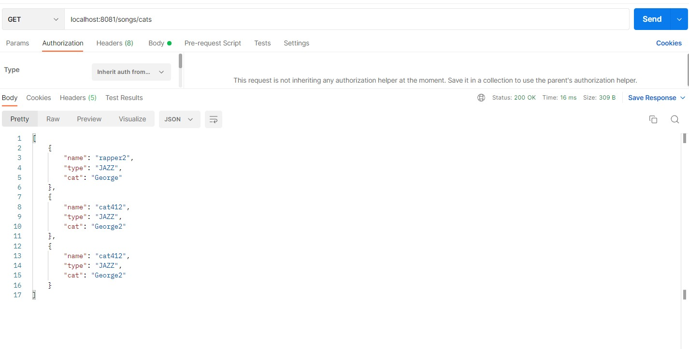
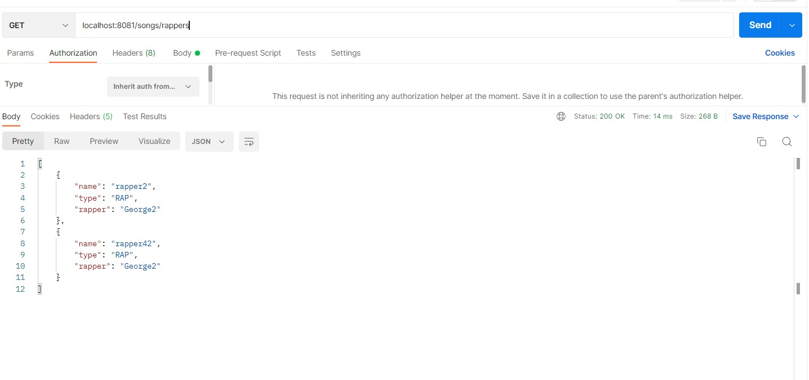
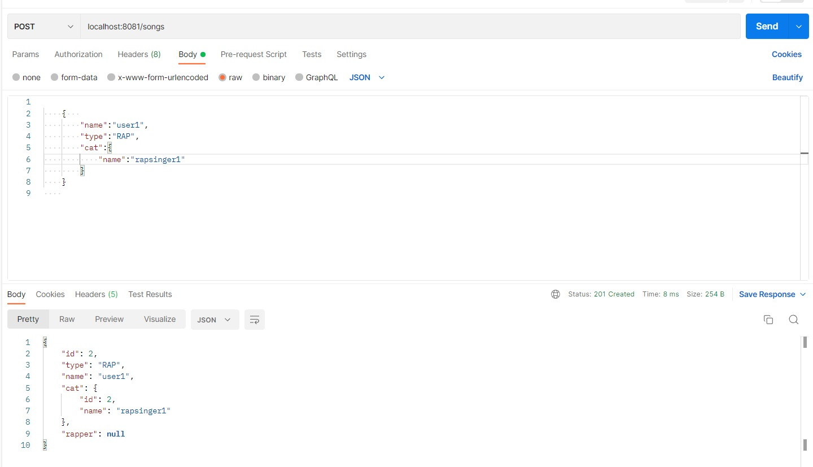
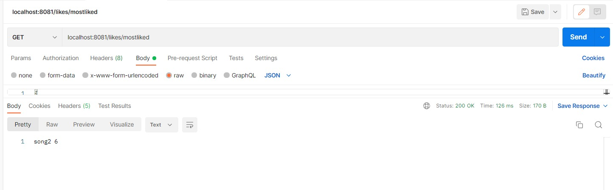
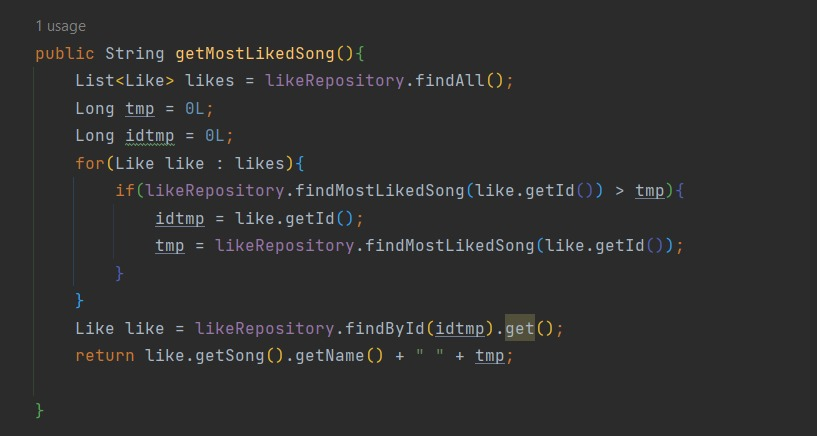
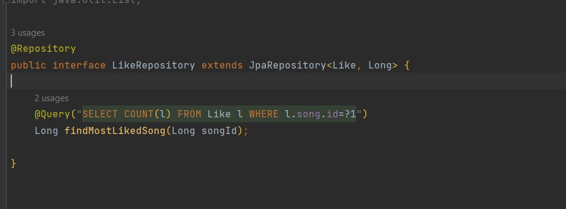

# Grispi Bootcamp Muzik ve Beğeni Projesi
``
    Cat: Eski dönemlerde Jazz muzisyenlerine takılan isim. Kedişko değil yani.
``

Bu proje ile Cat ve Rapper olarak sanatçıları ve Song olarak da şarkı ekleyebiliyoruz. Userlar ise istedikleri şarkıyı Likelayabiliyor ve en çok beğenilen şarkı görüntülenebiliyor.   

## Proje Hakkında

### Bu fotoğraflarda görüldüğü üzere cats ve rappers için basit Get ve Post methodları tanımlanmıştır.

### Bu fotoğrafta görüldüğü üzere cats ve rappers için basit GetById methodları tanımlanmıştır. (Delete ve Put işlemleri de yapılabiliyor)

### Burada şarkılara tanımlı Get methodu var.

### SongController classında şarkılara göre Cats veya Rappers seçerek eşleşen değerleri getirebiliyoruz. Bu sorgu servis katmanında Eğer tipi 'JAZZ' ise ve 'Cat' boş değilse veya  tipi 'RAP' ise ve 'Rapper' boş değilse sorguyu getir olarak yapmaktadır.

### Post Method

### Most Liked methodu ile en çok beğenilen şarkıyı Custom Query ile veritabanından bize getirir. Bu queryi manipüle ederek Liste halinde getirebiliriz.

### Gereklilikler

* Java 17
* Spring Boot
* PostMan

## Emeği Geçenler

Ersin Yılmaz ASLAN
ex. [@Kinto2517](https://github.com/Kinto2517)

## Geliştirme Önerileri

MostLiked sorgusu ile Liste döndürülebilir.